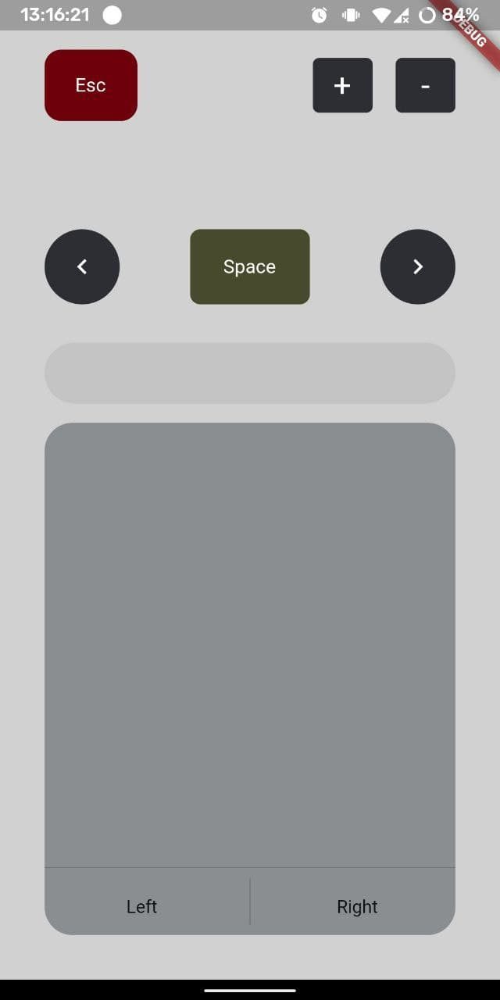

# Remote Controller

A simple flutter app that allow controll computer cursor from phone. 

Project is diveded in  two sub-projects **app** and **host program**.

**app** - is a flutter mobile application, it has : 

- a touch bar to get input and control the mouse cursor

- a textfield to get input and write it in computer

- some buttons like: *esc*, *space*, *pageUp*, *pageDown*, *left*, *right* 

- automated search for host in local network

- **udp** connection with **host** (for transfering changes of cursor postion)

- **http** connection to transfer text or to send keys commands

**host** - python program that run two threads one for flask rest api and second for Udp listener 

- rest api is for getting commands like press a button or write some text or to press a combination of keys in an order

- udp listener is to get dx and dy for add these to the actual positon of mouse
  
  **curentPostion + (dx,dy) = newPostion** <= repeting this several times per second will emulate the effect of moving 

***I know i could use just udp server without rest-api but when i designed it i was noob. Anyways after some thinking i realized that i could use it for future features.***

*Screshots:*

*designed by Me* 😅
